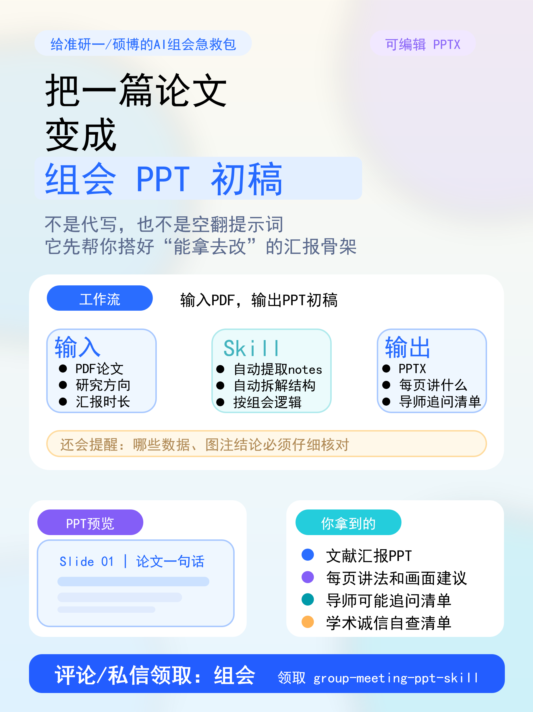

# group-meeting-ppt-skill

<p align="center">
  
</p>

> 输入 PDF，输出 10 页组会 PPT 初稿。中间会生成 notes JSON，方便回原文核对和二次修改。

一个面向中文科研组会/文献汇报的 Codex Skill MVP。

它的目标不是“AI 替你做组会”，而是帮你从 PDF 论文走到一版可以修改、可以展示、可以继续核对原文的及格 PPT 初稿：

- 从 PDF 自动提取第一版结构化 notes；
- 10 页组会 PPT 大纲；
- 每页应该讲什么；
- 建议重点放哪些图；
- 老师可能追问；
- 汇报前必须核对的学术诚信清单；
- 一键生成一个可编辑的 `.pptx` 草稿。

> 当前版本是 MVP：支持 `PDF → notes JSON → Markdown 资料包 / 10 页 PPTX 草稿`。PPT 不是最终答辩级成品，但已经足够用于短视频展示“输入 PDF → 输出组会文献汇报 PPT 初稿”的真实效果。

## 适合谁

- 研一第一次做文献组会的人；
- 每周要读论文汇报的硕士/博士；
- 本科毕设、文献汇报、课程展示需要快速搭结构的人；
- 想把论文阅读流程沉淀成 AI Skill 的人。

## 不做什么

- 不代写论文；
- 不编造实验数据；
- 不替你生成“保证老师满意”的答案；
- 不自动声称某个图支持某个结论；
- 不把 AI 输出当作原文事实。

## 项目结构

```text
group-meeting-ppt-skill/
  README.md
  skills/
    group-meeting-ppt-skill/
      SKILL.md
      agents/openai.yaml
      references/
      scripts/
        paper_pdf_to_notes.py
        create_pptx_from_pdf.py
        create_meeting_pack.py
        create_meeting_pptx.py
  examples/
    sample-paper.pdf
    sample-paper-input.json
    sample-output/
  media/
    group_meeting_ppt_skill_one_page_bright_20260703.png
    one-page-poster-copy.md
  tools/
    generate_one_page_poster.py
  tests/
    test_create_meeting_pack.py
    test_create_meeting_pptx.py
    test_create_pptx_from_pdf.py
```

## 快速演示

### 输入 PDF，直接输出 PPT 初稿

这是最适合对外展示的链路：

```powershell
& 'C:\Users\xieni\.cache\codex-runtimes\codex-primary-runtime\dependencies\python\python.exe' `
  skills/group-meeting-ppt-skill/scripts/create_pptx_from_pdf.py `
  --pdf examples/sample-paper.pdf `
  --out examples/sample-output/from_pdf_draft_group_meeting.pptx `
  --notes-json examples/sample-output/from_pdf_notes.json `
  --pack-outdir examples/sample-output/from-pdf-pack `
  --research-direction "数字微流控与多重核酸检测"
```

会生成：

```text
examples/sample-output/
  from_pdf_notes.json
  from_pdf_draft_group_meeting.pptx
  from-pdf-pack/
```

其中 `from_pdf_notes.json` 是中间结构化结果，建议先看一遍并回原文核对，再把 PPT 改成最终汇报版。

如果 PDF 自动抽取效果不够好，可以让 Codex 先读 PDF，修正 `from_pdf_notes.json`，再运行：

```powershell
& 'C:\Users\xieni\.cache\codex-runtimes\codex-primary-runtime\dependencies\python\python.exe' `
  skills/group-meeting-ppt-skill/scripts/create_meeting_pptx.py `
  --input examples/sample-output/from_pdf_notes.json `
  --out examples/sample-output/from_pdf_draft_group_meeting.pptx
```

### 已有结构化论文信息时

在项目根目录运行：

```powershell
python skills/group-meeting-ppt-skill/scripts/create_meeting_pack.py `
  --input examples/sample-paper-input.json `
  --outdir examples/sample-output
```

会生成：

```text
examples/sample-output/
  meeting_outline.md
  slide_plan.md
  advisor_questions.md
  integrity_checklist.md
```

如果要生成 PPTX，建议使用 Codex 自带 Python，或先安装 `python-pptx`：

```powershell
& 'C:\Users\xieni\.cache\codex-runtimes\codex-primary-runtime\dependencies\python\python.exe' `
  skills/group-meeting-ppt-skill/scripts/create_meeting_pptx.py `
  --input examples/sample-paper-input.json `
  --out examples/sample-output/draft_group_meeting.pptx
```

输出：

```text
examples/sample-output/draft_group_meeting.pptx
```

## 和同学那个 academic-meeting-skills.zip 的关系

这个版本借鉴的是“论文材料 → 组会展示产物”的产品思路，但没有直接复制 zip 里的脚本和 PPT 模板。

原因很简单：如果后续要发 GitHub、做公开视频或作为账号素材，最好保证代码、模板和文案都是可公开授权的。当前 PDF 抽取模块是重新实现的轻量版；等你确认同学授权后，可以再把更强的“图表区域抽取”和“参考模板套用”作为增强模块接进来。

## 安装为 Codex Skill

把 `skills/group-meeting-ppt-skill` 文件夹复制到你的 Codex skills 目录，或在 Codex 中直接引用这个 skill 文件夹。

## 测试

```powershell
python -m unittest discover -s tests -v
```

如果当前 Python 没有安装 `python-pptx` / `pdfplumber` / `reportlab`，相关测试会自动跳过。要完整验证 PDF 和 PPTX 生成功能，请使用 Codex 自带 Python：

```powershell
& 'C:\Users\xieni\.cache\codex-runtimes\codex-primary-runtime\dependencies\python\python.exe' `
  -m unittest discover -s tests -v
```

## 抖音展示建议

第一条图文/视频不要只放 GitHub 链接。更建议展示：

- `group-meeting-ppt-skill` 项目名；
- 文件树截图；
- 生成出来的 `from_pdf_draft_group_meeting.pptx` 首页或缩略图；
- “输入 PDF → 自动提取 notes JSON → 输出 10 页组会 PPT 草稿 + 追问清单”的流程图。

这样更像真实工具，也更适合你说的“给懒人配 AI”的账号路线。
